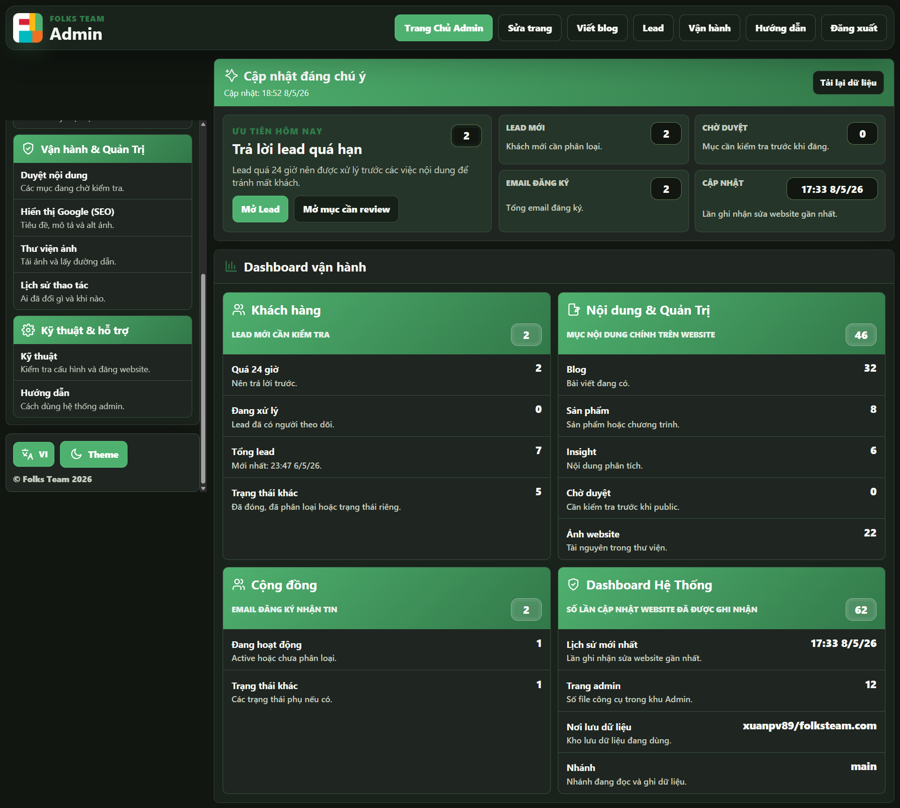

**_Có những nơi ta nhớ không phải vì cảnh đẹp, mà vì ở đó từng có người làm ta thấy mình được hiểu.
**_

Một quán nhỏ, một góc phố, một sân thượng lộng gió, một chuyến xe muộn; tất cả có thể trở thành ký ức chỉ vì từng có một người bạn ngồi đó, nói với ta vài câu tưởng như vu vơ. Khi rời đi, ta mang theo không gian ấy như mang theo một phần của tình bạn.

Bạn bè ở những nơi khác nhau dạy ta những cách sống khác nhau. Có người dạy ta chậm lại. Có người kéo ta ra khỏi sự nghiêm trọng quá mức. Có người không nói gì nhiều, chỉ xuất hiện đúng lúc để ta thấy mình không cô độc.
[tên liên kết](https://)

- ý chính
Thời gian làm mọi thứ thưa dần. Tin nhắn ít đi, cuộc gặp xa hơn, mỗi người bị cuốn vào một lịch trình riêng. Nhưng có những tình bạn không cần được chứng minh liên tục. Chỉ cần nhớ rằng đã từng có một đoạn đời, ở một nơi nào đó, ta và họ đã thật lòng với nhau.
